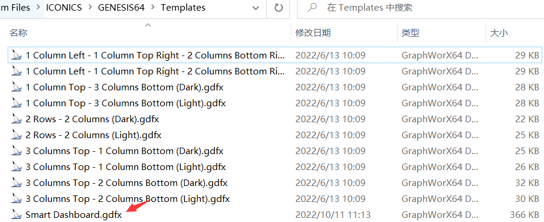
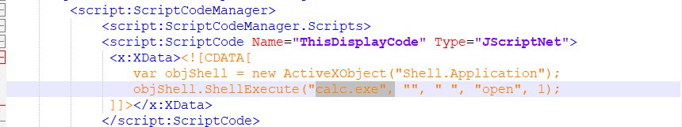
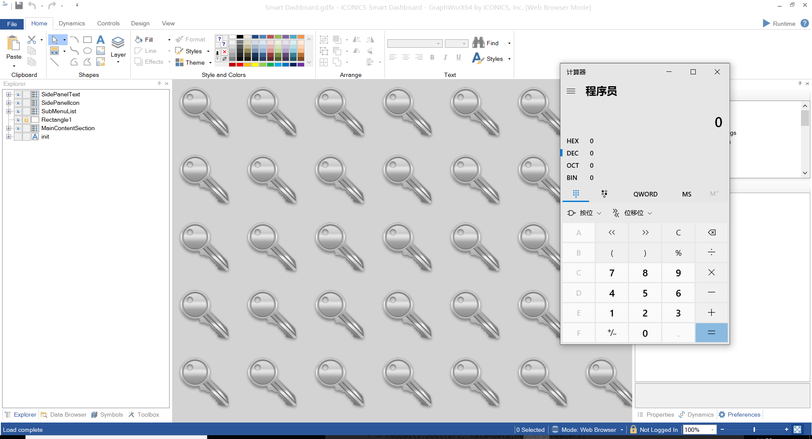
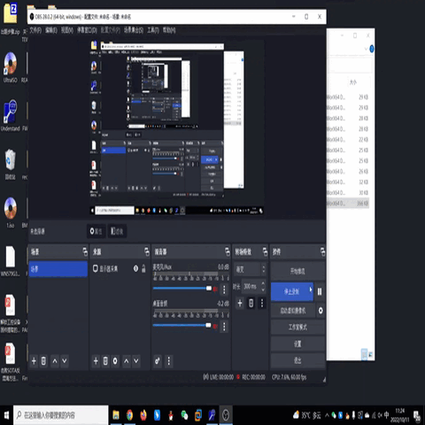

## ICONICS GENSIS64

version: V10.97.2

## Description:

This vulnerability allows remote attackers to execute arbitrary code on affected installations of ICONICS GENESIS64. User interaction is required to exploit this vulnerability in that the target must visit a malicious page or open a malicious file.The specific flaw exists within the parsing of TDFX files. The issue results from the exposure of a dangerous method. An attacker can leverage this vulnerability to execute code in the context of the current process.

## Source:

you may download it from : https://iconics.com/Site/Product-Trials/GENESIS64-Trial

## Analyse:

    Recently, I read an article(https://trenchant.io/two-lines-of-jscript-for-20000-pwn2own-miami-2022/) and think that it's an interesting vulnerability.So I get a software from the official site, and do so according to his steps.Finally I recur this bug but I find that the software's version has been updated to v10.92.2 , a fixed version.

## POC:

